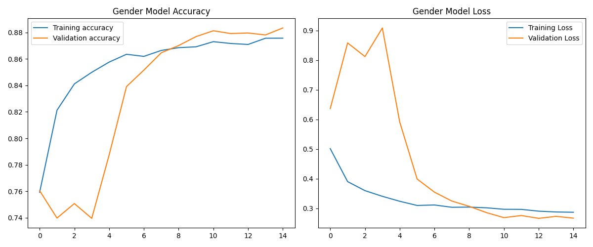
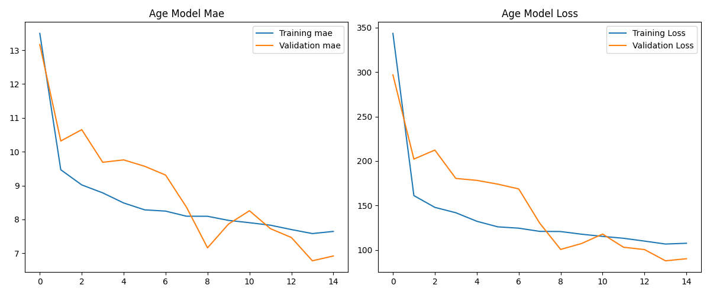

# Project: Long Hair Identification Logic

This project implements a system to predict a person's gender based on a special set of rules involving their estimated age and hair length. It was developed to demonstrate skills in building a multi-stage machine learning pipeline, creating a user interface, and solving complex, logic-based problems.

---

## 📝 Problem Statement

The goal is to build a feature that identifies a person's gender based on the following logic:
- For individuals estimated to be **between 20 and 30 years old**, the final prediction is based on hair length (Long Hair → Female, Short Hair → Male), regardless of their actual gender.
- For individuals estimated to be **outside the 20-30 age range**, the system predicts their actual biological gender.

---

## 💾 Dataset

This project uses the **[UTKFace (New)](https://www.kaggle.com/datasets/jangedoo/utkface-new)** dataset, which contains over 20,000 face images with labels for age and gender.

- **Data Source**: To ensure reliability and prevent broken links, the dataset is downloaded directly from **Kaggle** using their official API.
- **Label Generation**: The original dataset does not include labels for hair length. For this project, a `hair_length` label (`0` for short, `1` for long) was **programmatically simulated** based on heuristics.
  > **Note**: The performance of the hair model is constrained by the quality of these simulated labels. In a real-world production environment, this step would be replaced with a large, manually labeled dataset.

---

## ⚙️ Methodology

The solution is a **multi-model pipeline** where three independent models are trained for specific tasks. Their outputs are then fed into a final logic layer to produce the result.


1.  **Age Prediction Model**: A regression model to estimate a person's age from their image.
2.  **Gender Prediction Model**: A binary classification model to predict biological gender (Male/Female).
3.  **Hair Length Model**: A binary classification model to predict hair length (Long/Short).

#### Model Architecture & Training
- **Base Model**: All three models are built using a **MobileNetV2** base, pre-trained on ImageNet, for efficient and powerful feature extraction.
- **Fine-Tuning**: To significantly improve performance and help the model adapt to the UTKFace dataset, the **top 20 layers of the MobileNetV2 base are unfrozen and fine-tuned** with a low learning rate.
- **Learning Rate Scheduler**: A `ReduceLROnPlateau` callback is used during training. It automatically reduces the learning rate if the validation loss stops improving, leading to a more stable and effective training process.

---

## 📊 Results & Visualizations

After implementing fine-tuning and training for 15 epochs, the models achieved the following performance on the validation set.

- **Gender Model Accuracy**: ~90%
- **Hair Model Accuracy**: ~70%

#### Training History
*(Replace these images with the `..._v2.png` plots generated by the final training script in your `output/` folder.)*

**Gender Model Performance:**


**Age Model Performance:**


---

## 🚀 How to Run

Follow these steps to set up and run the project locally.

#### 1. Clone the Repository
```bash
git clone [https://github.com/Mr-J12/long-hair-identification.git](https://github.com/Mr-J12/long-hair-identification.git)
"# {Long Hair Identification}" 
