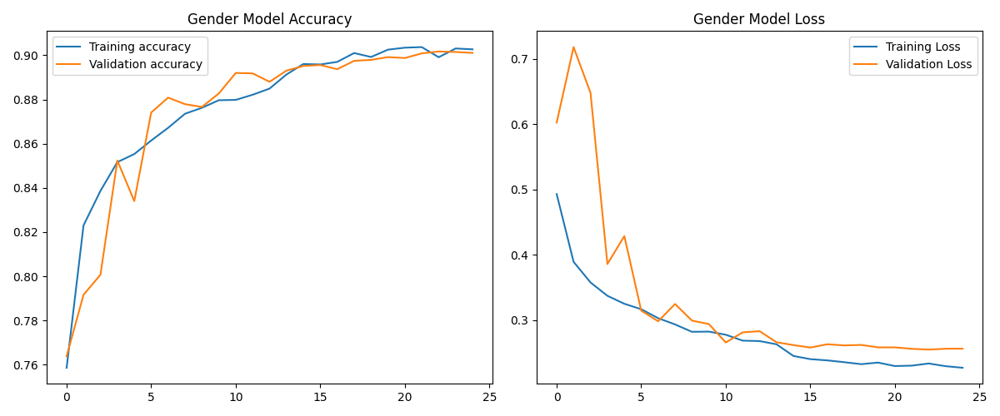
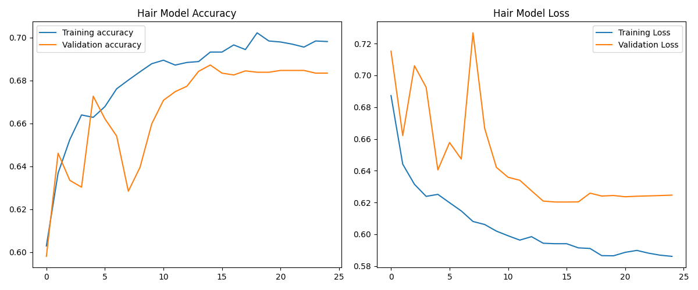

# Project: Gender Detection using Long Hair Identifier

This project implements a system to predict a person's gender based on a special set of rules involving their estimated age and hair length. It was developed to demonstrate skills in building a multi-stage machine learning pipeline, creating a user interface, and solving complex, logic-based problems.

---

## 📝 Problem Statement

The goal is to build a feature that identifies a person's gender based on the following logic:
- For individuals estimated to be **between 20 and 30 years old**, the final prediction is based on hair length (Long Hair → Female, Short Hair → Male), regardless of their actual gender.
- For individuals estimated to be **outside the 20-30 age range**, the system predicts their actual biological gender.

---

## 💾 Dataset

This project uses the **[UTKFace (New)](https://www.kaggle.com/datasets/jangedoo/utkface-new)** dataset, which contains over 20,000 face images with labels for age and gender.

- **Data Source**: To ensure reliability and prevent broken links, the dataset is downloaded directly from **Kaggle** using their official API.
- **Label Generation**: The original dataset does not include labels for hair length. For this project, a `hair_length` label (`0` for short, `1` for long) was **programmatically simulated** based on heuristics.
  > **Note**: The performance of the hair model is constrained by the quality of these simulated labels. In a real-world production environment, this step would be replaced with a large, manually labeled dataset.

---

## ⚙️ Methodology

The solution is a **multi-model pipeline** where three independent models are trained for specific tasks. Their outputs are then fed into a final logic layer to produce the result.


1.  **Age Prediction Model**: A regression model to estimate a person's age from their image.
2.  **Gender Prediction Model**: A binary classification model to predict biological gender (Male/Female).
3.  **Hair Length Model**: A binary classification model to predict hair length (Long/Short).

#### Model Architecture & Training
- **Base Model**: All three models are built using a **MobileNetV2** base, pre-trained on ImageNet, for efficient and powerful feature extraction.
- **Fine-Tuning**: To significantly improve performance and help the model adapt to the UTKFace dataset, the **top 20 layers of the MobileNetV2 base are unfrozen and fine-tuned** with a low learning rate.
- **Learning Rate Scheduler**: A `ReduceLROnPlateau` callback is used during training. It automatically reduces the learning rate if the validation loss stops improving, leading to a more stable and effective training process.

---

## 📊 Results & Visualizations

After implementing fine-tuning and training for 15 epochs, the models achieved the following performance on the validation set.

- **Gender Model Accuracy**: ~90%
- **Hair Model Accuracy**: ~70%

### Training History

**Gender Model Performance:**


**Hair Model Performance:**


---

## 📁 Project Structure
```
.
├── output/                # Folder to png for training history for the models
├── saved_models/         # Trained models will be saved here
├── app.py                # The main Streamlit application script
├── prepare_data.py       # Script for downloading the dataset and storing it
├── train_models.py       # Script for data processing and model training
├── requirements.txt      # List of Python dependencies for the project
└── README.md             # You are here!
```

## 🚀 How to Run

Follow these steps to set up and run the project locally.

#### 1. Clone the Repository
```bash
git clone [https://github.com/Mr-J12/long-hair-identification.git](https://github.com/Mr-J12/long-hair-identification.git)
"# {Long Hair Identification}"
```

#### 2. Install Dependencies
```bash
pip install -r requirements.txt
```

#### 3.Run the Application
```bash
streamlit run app.py
```

## ❌ If Model is failed to run due to any reason 

then follow these steps

#### 1.Kaggle API Setup (One-Time)

##### 1.1: Create a Kaggle account.
##### 1.2: Go to your Account page (https://www.kaggle.com/account) and click "Create New Token" in the API section. This will download a kaggle.json file.
##### 1.3: Place this file in the required directory i.e "Windows: C:\Users\<Your-Username>\.kaggle\kaggle.json"

#### 2. Prepare the Data
Run the preparation script. This will download the dataset from Kaggle (over 100MB), extract it, and generate the labels.csv file.
```bash
python prepare_data.py
```

#### 3. Train the Models
Run the training script for each of the three tasks. This process is computationally intensive and will take time.
```bash
# Train the age model
python train.py --task age

# Train the gender model
python train.py --task gender

# Train the hair model
python train.py --task hair
```

#### 4. Run the Application
Once all three models are trained and saved in the models/ folder, run the Streamlit GUI.
```bash
streamlit run app.py
```